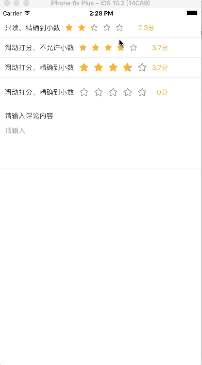

# react-native-star-rating-view
StarRatingView for react-native, supporting decimal fraction and sliding rating.
Inspired by [HCSStarRatingView](https://github.com/hsousa/HCSStarRatingView)

# Demo
see the [Demo](Demo/StarRatingViewDemo)



# Install
Note: need [`react-native-vector-icons`](https://github.com/oblador/react-native-vector-icons)

If you do not want to import `react-native-vector-icons`, 
try the [`purejs branch`](https://github.com/ksti/react-native-star-rating-view/tree/purejs#install) 

```
npm install react-native-star-rating-view --save
```
# Usage

```js

import StarRatingBar from 'react-native-star-rating-view/StarRatingBar'

...

// readOnly, allow accurate value(只读、显示小数)
<StarRatingBar
    score={2.3}
    dontShowScore={false} // true: not show the score text view
    allowsHalfStars={true}
    accurateHalfStars={true}
/>
// sliding rating, not allow accurate value(滑动打分、不允许小数)
<StarRatingBar
    readOnly={false}
    continuous={true}
    score={3.7}
    onStarValueChanged={(score) => {
        console.log('new score:' + score);
    }}
/>
// sliding rating, allow accurate value(滑动打分、精确到小数)
<StarRatingBar
    starStyle={{
        width: 20,
        height: 20,
    }}
    readOnly={false}
    continuous={true}
    score={3.7}
    allowsHalfStars={true}
    accurateHalfStars={true}
    onStarValueChanged={(score) => {
        console.log('new score:' + score);
    }}
/>

```

## customize star image(自定义图片)

```js

// readOnly(默认只读、不显示小数)
<StarRatingBar
    score={2.3}
    //emptyStarColor='#ff6666'
    //tintColor='#ff6666'
    emptyStarImage={<Image style={{width:16, height: 16}} source={{uri: 'emptyStar.png: your image path'}} />}
    filledStarImage={<Image style={{width:16, height: 16}} source={require('star.png: your image path')} />}
    scoreTextStyle={{color:'#ff6666'}}
/>

// customize star size(自定义尺寸大小)
<View style={{height: 60, flexDirection: 'row', alignItems: 'center'}}>
    <StarRatingBar
        score={2.3}
        //emptyStarColor='#ff6666'
        //tintColor='#ff6666'
        starStyle={{
            width: 26,
            height: 26,
        }}
        emptyStarImage={<Image style={{width: 26, height: 26}} source={{uri: 'emptyStar.png: your image path'}} />}
        filledStarImage={<Image style={{width: 26, height: 26}} source={require('star.png: your image path')} />}
        scoreTextStyle={{color:'#ff6666'}}
    />
</View>

```

# License
MIT